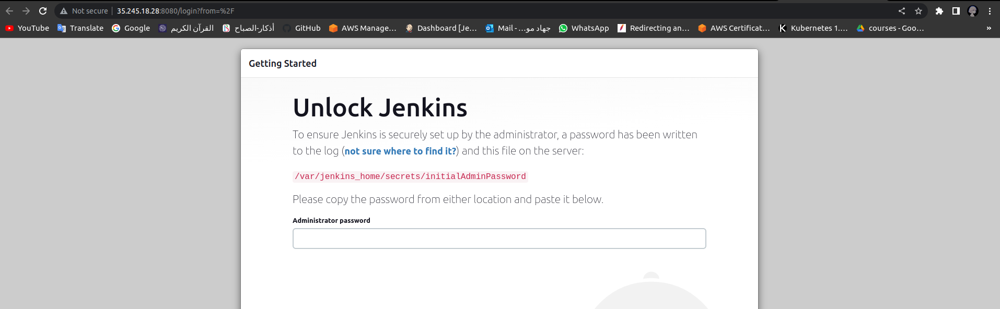

## Overview
Deploy a Python web application on GKE using CI/CD Jenkins Pipeline using the following steps and high-level diagram:

1. Implement a secure GKE Cluster
2. Deploy and configure Jenkins on GKE
3. Deploy the backend application on GKE using the Jenkins pipeline


### Used Tools
 - Terraform
 - Jenkins
 - Docker
 - Ansible
 - Kubernates


##### And all work is applied on GCP project: jehad-iti, and region: us-east4


### First part of project: Infrastructure

#### Creating resources with terraform:
in terraform directory:
```bash
$ terraform init
$ terraform plan
$ terraform apply
```
#### SSH into VM:
```bash
$ gcloud compute ssh --zone "us-east4-c" "my-vm"  --project "jehad-iti"
```

#### Connect to cluster:
```bash
$ gcloud container clusters get-credentials cluster-pv --zone us-east4-c --project jehad-iti
```

#### Check pods and get load balancer external IP:
```bash
kubectl get all -n jenkins
```
#### Now we are ready to use Jenkins


#### Get Jenkines password:
```bash
$ kubectl exec --namespace jenkins -it svc/jenkins-service -c jenkins -- /bin/cat /var/jenkins_home/secrets/initialAdminPassword && echo
```

### You can check Part two: <a href="https://github.com/jehad215/Final-project-app.git" target="_blank">CI/CD in Jenkins</a>
